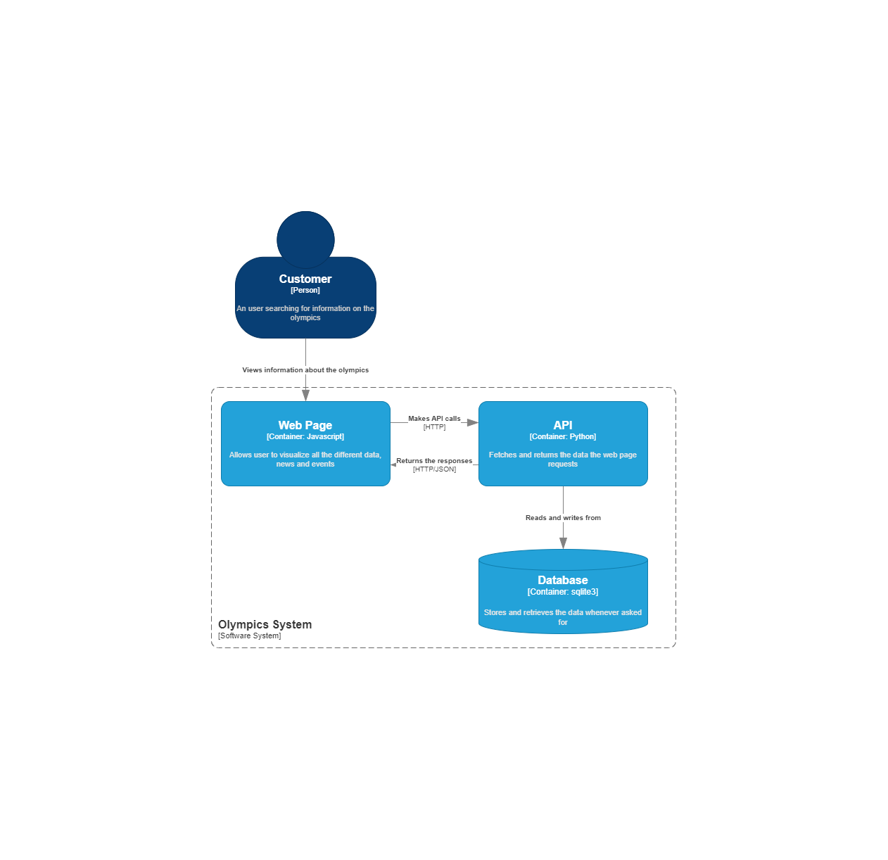

# Software-Engineering---MC656-2024-1s

1. Gabriel de Carvalho Silva Nascimento - 222103
2. Mateus da Costa e Silva Rios Alves de Andrade - 230806
3. Joao Eduardo Vasconcellos da Silva - 248343
4. Breno Shigeki Guimarães Nishimoto - 220599
5. Guilhermo de Luiggi Mocelim de Oliveira - 223325

## Estilo arquitetural e padrões de projeto
### Diagrama C4

Aqui, cada componente do tipo controller aguarda ser contatado pela web page. Quando seu endpoint é acessado, o controller então envia a querry relativa à sua função para o componente responsável por acessar a database, que por sua vez executa a querry e retorna o resultado

### REST
O estilo arquitetural REST (Representational State Transfer) é uma abordagem para a construção de sistemas distribuídos e serviços web que utiliza as tecnologias e os protocolos da web, em especial o HTTP, para comunicação. No REST, os recursos são as entidades centrais, identificadas por URIs (Uniform Resource Identifiers), e as operações sobre esses recursos são realizadas através dos métodos HTTP

### Padrão de Projeto
Decidimos utilizar o padrão de projeto "Singleton", implementado no nosso componente de acesso à database. Assim, sempre há uma e apenas uma conexão com a database, evitando erros e incosistências
[Link para a issue de implementação do singleton](https://github.com/JevsJevs/SoftwareEngineering-MC656-2024-1s/issues/41)

## Code smells
[Link para a issue referente aos code smells encontrados](https://github.com/JevsJevs/SoftwareEngineering-MC656-2024-1s/issues/38)
